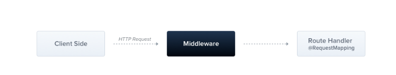

### Middleware



implement custom Nest middleware in either a function, or in a class with an @Injectable() decorator. The class should implement the NestMiddleware interface


### Build-in exceptions

1. BadRequestException
2. UnauthorizedException
3. NotFoundException
4. ForbiddenException
5. NotAcceptableException
6. RequestTimeoutException
7. ConflictException
8. GoneException
9. HttpVersionNotSupportedException
10. PayloadTooLargeException
11. UnsupportedMediaTypeException
12. UnprocessableEntityException
13. InternalServerErrorException
14. NotImplementedException
15. ImATeapotException
16. MethodNotAllowedException
17. BadGatewayException
18. ServiceUnavailableException
19. GatewayTimeoutException
20. PreconditionFailedException

All the built-in exceptions can also provide both an error cause and an error description using the options parameter:

```throw new BadRequestException('Something bad happened', { cause: new Error(), description: 'Some error description' })```


### pipes

A pipe is a class annotated with the `@Injectable()` decorator, which implements the `PipeTransform` interface.

Pipes have two typical use cases:

1. **transformation:** transform input data to the desired form (e.g., from string to integer)
2. **validation:** evaluate input data and if valid, simply pass it through unchanged; otherwise, throw an exception


Nest comes with nine pipes available out-of-the-box:

1. ValidationPipe
2. ParseIntPipe
3. ParseFloatPipe
4. ParseBoolPipe
5. ParseArrayPipe
6. ParseUUIDPipe
7. ParseEnumPipe
8. DefaultValuePipe
9. ParseFilePipe


